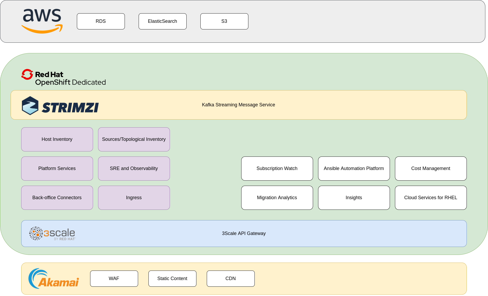

## What is the Cloud Services Platform?

The Cloud Services Platform (sometimes called the Insights Platform or simply
"the Platform") is a collection of services and standards for customer-facing 
applications hosted at [cloud.redhat.com](https://cloud.redhat.com).

First, the Platform is a set of services. These include:

* Infrastructure - such as OpenShift, Kafka, 3Scale, and integration with the
  customer portal
* Management and observability - such as CI/CD, metrics, monitoring, and logging
* Data modeling and state - such as managed host inventory and connected 
  infrastructure
* Data ingestion and processing - such as the `insights-client`, the Cloud
  Connector, and the Insights Rules Engine

The purpose of these services is to simplify the deployment of customer-facing
applications, accelerate the time-to-market, and to ensure consistency of state
for customer data.

Second, the Platform is a set of standards. These include:

* Common user interface standards and components
* Common user experience design
* Common API specifications

The purpose of these standards is to ensure all applications present to the
customer as part of a consistent, cohesive whole.

## 10,000 foot view

The Platform infrastructure is hosted on OpenShift Dedicated running inside of
Amazon Web Services, and web traffic to cloud.redhat.com is mediated by the
Akamai CDN.

All applications and services run on OpenShift. This cluster is managed by the
[Service Delivery](https://mojo.redhat.com/groups/service-delivery) team: the
Platform SRE team manages the cluster and the undercloud, and the AppSRE team
governs the services running inside of the cluster.

The applications and services on the cluster take advantaged of some managed
AWS services: S3 for object storage, RDS for relational databases, ElasticCache
for Redis, and Amazon Elasticsearch Service. We strive to only use AWS services
with non-proprietary interfaces to minimize our dependence on a particular
public cloud provider.

All public API request into cloud.redhat.com flows through the Akamai CDN, which
serves static content, enforces a Web Application Firewall, and handles SSL
termination.
