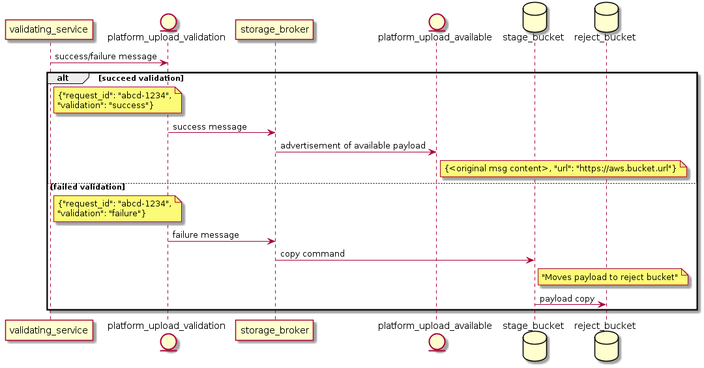
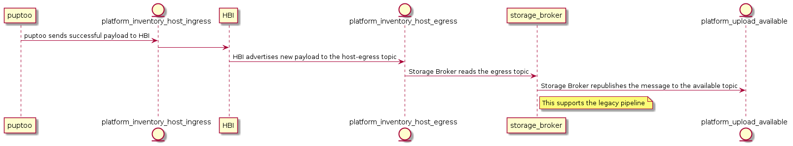

The Insights Storage Broker microservice is responsible for moving
uploaded packages from the staging to rejected storage bucket in the
event the file fails validation. It will also advertise successful
payloads to the platform via the `  platform.upload.available topic  ` .
It reads from the `  platform.upload.validation  ` and ` 
platform.inventory.host-egress  ` topics by default.

## How It Works

### Standard Workflow

Insights Storage Broker consumes from the `  platform.upload.validation
 ` topic. If the payload has succeeded vaildation, the storage broker
will pass the message along with a download url to the ` 
platform.upload.available  ` topic so that other services on the
platform can consume it. Storage Broker expects to receive all the data
in the message that the validation service originally received in
addition to the `  validation  ` key.

If a failure message is received, Storage Broker will copy the file to
the rejected bucket and not advertise the availabiliity of the payload
to the platform.

### Advisor Workflow

The advisor workflow is slightly different. Advisor payloads are
processed and sent directly to Host Based Inventory (HBI) to be handled.
HBI will pass these successful payloads to the ` 
platform.inventory.host-egress  ` topic. Services that are not reading
from this topic yet may still expect new payloads to be announced on ` 
platform.upload.available  ` . In order to support these, Storage Broker
wil read the HBI announcements and then republish them on ` 
platform.upload.available  ` in the expected legacy format.

## Messages

Available Message:

    {
      "account": "<account number>",
      "request_id": "<uuid for the payload>",
      "principal": "<currently the org ID>",
      "service": "<the service that validated the payload>",
      "url": "<URL to download the file>",
      "b64_identity": "<the base64 encoded identity of the sender>",
      "id": "<host based inventory id if available>",
      "satellite_managed": "<boolean if the system is managed by satellite>",
      "timestamp": "<the time the available message was put on the topic>",
      "extras": {
          "satellite_managed": "<same as above>"
          "id": "<same as above>"
       }
    }

